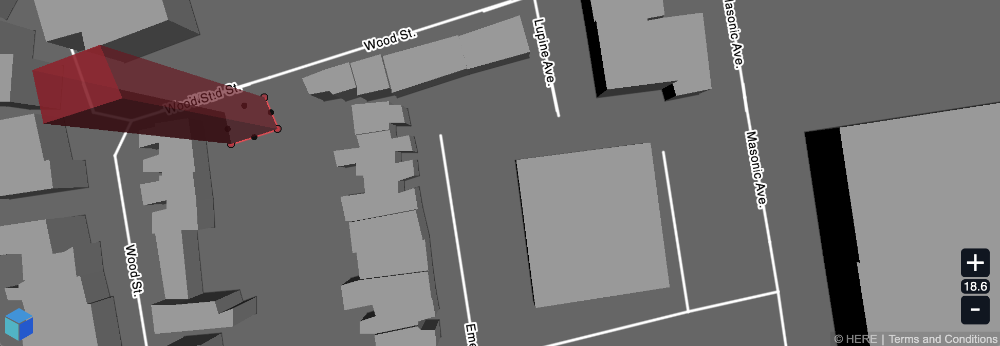

# XYZ Maps JS
[](https://opensource.org/licenses/Apache-2.0)


XYZ Maps is an experimental and work in progress open-source map editor written in TypeScript/JavaScript.

[](https://heremaps.github.io/xyz-maps/playground/#Display-Pitch_and_Rotate_Map)

* [API Playground](https://heremaps.github.io/xyz-maps/playground/#Display-Pitch_and_Rotate_Map)
* [Documentation](https://heremaps.github.io/xyz-maps/docs/)

## Overview
XYZ Maps consists of the following main modules:
* [@here/xyz-maps-common](packages/common) : The Common module provides commonly used javascript functionality that is required by all other modules of XYZ Maps.
* [@here/xyz-maps-core](packages/core) : The Core module provides the most basic functionality. Main functionalities of the module are: DataProviders, TileLayers, Geometric Classes and Styling definitions.
* [@here/xyz-maps-display](packages/display) : The Display module is a highly customizable vector map display that's optimized for map editing, larger raw datasets and frequently changing data.
* [@here/xyz-maps-editor](packages/editor) : The Editor module provides an API for editing map data that can be used to easily access, add, remove and edit various types of map data.

## Prerequisites

* [Node.js](https://nodejs.org) (8.16.0+)
* [Yarn](https://yarnpkg.com/en/docs/install) (1.11.0+)


## Start developing

1. Clone this repository

    ```
    git clone https://github.com/heremaps/xyz-maps.git

    cd xyz-maps
    ```

2. Install node module dependencies
    ```
    yarn install
    ```

3. watch for source code changes and build dev version
    ```
    yarn run watch-dev
    ```
    Builds are located in `./packages/*/dist/`


## Setup your XYZ token

Setup an XYZ token is only required if the XYZ Hub endpoint at xyz.api.here.com is used.
You can get a token by following the instructions in this [guide](https://www.here.xyz/api/getting-token/).

If you are using a [local XYZ Hub](https://github.com/heremaps/xyz-hub#getting-started) simply set `set-access-token` to an empty string.

Running integration tests / playground and debug pages requires the XYZ token to be provided.

* Configure your XYZ token
    ```
    yarn run set-access-token YOUR_ACCESS_TOKEN
    ```

## Serve debug page

* Start debug server (requires xyz access token)
    ```
    yarn run server
    ```
    browser will start and open http://localhost:8080/debug automatically


## Serve Playground

* Build and start the playground (requires xyz access token)
    ```
    yarn run playground
    ```
    browser will start and open http://localhost:8081/packages/playground/dist automatically


## Other Commands

* Run tests on release build `yarn run test`

* Build development version `yarn run build-dev` (located in docs/)

* Build release version only `yarn run build-release` (minified...)

* Build the documentation `yarn run build-doc` (located in packages/docs/dist/)

* Create full release bundle `yarn run bundle-release` (includes documentation and playground)

* Configure XYZ access token `yarn run set-access-token YOUR_ACCESS_TOKEN`


## Guides

* [Getting started](https://github.com/heremaps/xyz-maps/wiki/Getting-started)
* [Display your space](https://github.com/heremaps/xyz-maps/wiki/Display-your-space)
* [Style your data](https://github.com/heremaps/xyz-maps/wiki/Style-your-data)
* [Add interactivity](https://github.com/heremaps/xyz-maps/wiki/Add-interactivity)


## License

Copyright (C) 2019-2021 HERE Europe B.V.

This project is licensed under the Apache License, Version 2.0 - see the [LICENSE](LICENSE) file for details
